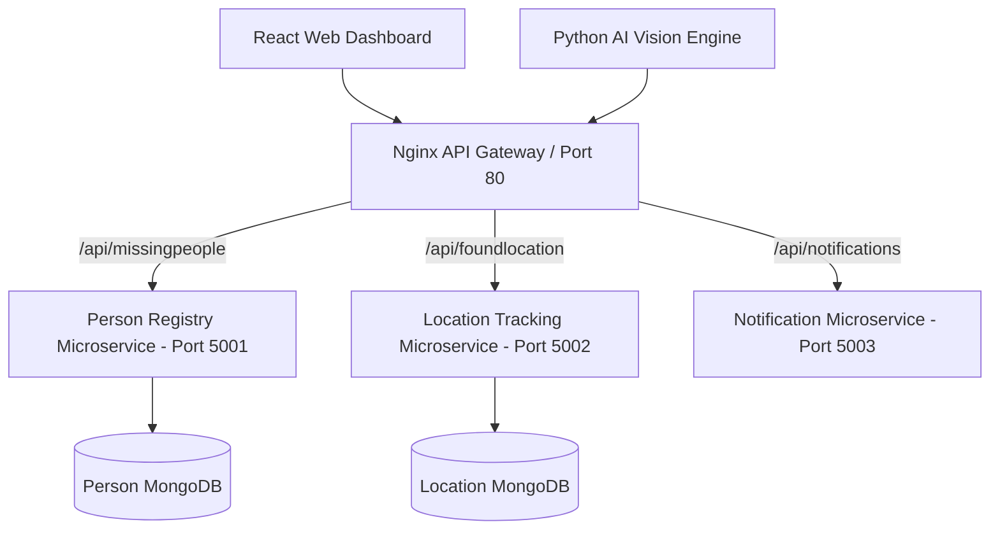

# FaceTrace - Missing Person Surveillance Microservices

FaceTrace is an AI-powered surveillance and missing person tracking system built using a production-grade **Microservices Architecture**, **Docker containerization**, **Kubernetes orchestration**, and an automated **GitHub Actions CI/CD pipeline**.

> 🎓 **Teacher Presentation Guide**: Want a step-by-step guide on how to explain Docker & Kubernetes to your professor/teacher? Read [`TEACHER_EXPLANATION_GUIDE.md`](file:///c:/Users/jayau/FaceTrace/Face_recognition_Finding_missing_people-master/TEACHER_EXPLANATION_GUIDE.md).

---

## 🏗️ Architecture Overview



### Microservices Breakdown
1. **API Gateway (`/gateway`)**: Nginx reverse proxy serving on port 80 routing traffic to internal services.
2. **Person Registry Microservice (`/services/person-service`)**: Node.js/Express service for profile CRUD, Aadhaar identification, and image upload management.
3. **Location Tracking Microservice (`/services/location-service`)**: Node.js/Express service for tracking camera sightings, coordinates, and timestamps.
4. **Notification Microservice (`/services/notification-service`)**: Node.js service for dispatching automated WhatsApp/Twilio alerts.
5. **AI Vision Recognition Service (`/face_recognition`)**: Streamlit + OpenCV Python service for real-time video feed ingestion and face matching.
6. **Frontend Dashboard (`/Frontend/frontend MS/msfrontend`)**: React application for web dashboard management.

---

## ⚠️ Errors Faced During Development & Setup (Troubleshooting Guide)

Below is a summary of technical errors encountered during the refactoring process and how each was resolved:

### 1. OpenCV & dlib Native Compilation Failures in Docker
- **Problem**: Python container build failed during `pip install -r requirements.txt` due to missing C++ compilation headers for `dlib` and OpenCV.
- **Root Cause**: `dlib` requires CMake and C++ build tools which are missing in minimal Python base images.
- **Resolution**: Updated `face_recognition/Dockerfile` to install native dependencies (`build-essential`, `cmake`, `libgl1-mesa-glx`, `libglib2.0-0`) before installing Python packages.

### 2. GitHub Actions Working Directory Path Mismatches
- **Problem**: CI/CD pipeline failed with `No such file or directory` when attempting `cd Face_recognition_Finding_missing_people-master`.
- **Root Cause**: `actions/checkout@v4` checks out files directly into the repository root `$GITHUB_WORKSPACE`.
- **Resolution**: Configured `.github/workflows/ci-cd.yml` steps to execute relative to repository root `.`.

### 3. MongoDB Connection Race Condition on Container Startup
- **Problem**: Node.js microservices crashed on startup because MongoDB container was still initializing database sockets.
- **Root Cause**: Container startup order in Docker Compose did not wait for MongoDB health check readiness.
- **Resolution**: Added `mongosh` healthchecks (`db.adminCommand('ping')`) in `docker-compose.yml` and configured `depends_on: { condition: service_healthy }` alongside Kubernetes readiness probes.

### 4. Hardcoded `localhost` URLs in Containerized Environments
- **Problem**: Python AI service and React frontend failed to reach backend services inside Docker/Kubernetes container networks.
- **Root Cause**: `http://localhost:5000` points to container local loopback instead of service network hostnames.
- **Resolution**: Refactored code to consume environment variable `GATEWAY_URL` (`http://gateway:80` for Docker Compose, `http://facetrace-gateway-service...` for Kubernetes).

### 5. CORS Policy Violations
- **Problem**: Frontend browser requests were blocked due to Cross-Origin Resource Sharing restrictions.
- **Resolution**: Enabled `cors()` middleware on all Express microservices and configured proxy headers (`proxy_set_header Host $host`, `proxy_set_header X-Real-IP $remote_addr`) in Nginx API Gateway.

---

## 🚀 How to Run the Project

### Option A: Local Development with Docker Compose (Recommended)
Run the entire microservices mesh, MongoDB databases, and API Gateway with a single command:

```bash
# Build and start all microservice containers
docker compose up --build
```

**Access Endpoints:**
- **Web Dashboard**: [http://localhost](http://localhost)
- **API Gateway Health**: [http://localhost/health](http://localhost/health)
- **AI Surveillance App**: [http://localhost:8501](http://localhost:8501)

To stop services:
```bash
docker compose down
```

---

### Option B: Deploying to Kubernetes (k8s)
Deploy microservices, databases, ConfigMaps, and Ingress routing to a local cluster (Minikube / Docker Desktop / K3s):

```bash
# 1. Apply Namespace, ConfigMaps, and Secrets
kubectl apply -f k8s/01-namespace-config.yaml

# 2. Deploy MongoDB StatefulSets
kubectl apply -f k8s/02-databases.yaml

# 3. Deploy Microservices
kubectl apply -f k8s/03-microservices.yaml

# 4. Deploy Ingress Gateway
kubectl apply -f k8s/04-ingress-gateway.yaml
```

**Verify Deployment:**
```bash
kubectl get pods -n facetrace
kubectl get services -n facetrace
```

---

### Option C: Running Automated CI/CD Pipeline (GitHub Actions)
The repository includes an automated GitHub Actions pipeline located at `.github/workflows/ci-cd.yml`.

**Pipeline Stages:**
1. **Automated Unit Testing**: Runs Node.js (`node --test`) and Python (`unittest`) tests.
2. **Docker Build Validation**: Validates `docker compose config` and builds container images.
3. **Kubernetes Validation**: Performs dry-run validation (`kubectl apply --dry-run=client`) on all `k8s/*.yaml` manifests.

To trigger the pipeline:
```bash
git add .
git commit -m "Deploy microservices CI/CD update"
git push origin main
```

---

### Option D: Running Unit Tests Locally

```bash
# Test Person Microservice
cd services/person-service
node --test test/person.test.js

# Test Location Microservice
cd ../location-service
node --test test/location.test.js

# Test AI Recognition Service
cd ../face_recognition
python -m unittest test_apicall.py
```
