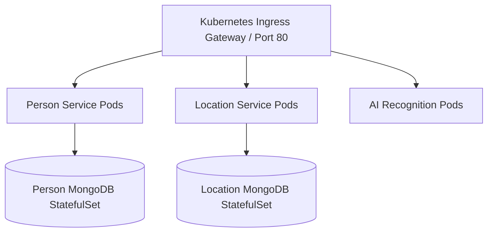

# How Docker & Kubernetes Work (Baby Steps)

This guide is designed to help you explain **Docker**, **Kubernetes**, and your **Microservices Architecture** to your teacher in simple, easy-to-understand "baby steps".

---

## 🎯 1-Minute Executive Summary for You

> * our project **FaceTrace** is a missing person surveillance system. Instead of building one huge monolithic application, we split it into **independent microservices** (Person Service, Location Service, Notification Service, AI Engine, Frontend). We package each service into a **Docker Container** so it runs on any operating system without dependency issues. Then, we use **Kubernetes** (or **Docker Compose**) to orchestrate, auto-scale, and route network traffic across all services automatically."*

---

## 🐳 Part 1: How Docker Works (Explained in Baby Steps)

Think of Docker like shipping physical shipping containers across the world:

```
[ Your Code + Node.js + Libraries ]  --->  [ Dockerfile Recipe ]  --->  [ Docker Image ]  --->  [ Docker Container (Running Application) ]
```

### 4 Simple Terms to Tell Your Teacher:

1. **Dockerfile (The Recipe)**:
   - A step-by-step text file telling Docker how to build a microservice environment.
   - *Analogy*: A cake recipe.

2. **Docker Image (The Frozen Blueprint)**:
   - A lightweight, standalone package containing code, runtime, system tools, and libraries.
   - *Analogy*: The baked cake frozen in the fridge.

3. **Docker Container (The Active App)**:
   - A live, running process created from a Docker Image.
   - *Analogy*: Eating the cake on your plate.

4. **Docker Compose (The Orchestra Director)**:
   - A single configuration file (`docker-compose.yml`) that starts all 6 microservices + MongoDB databases together on a shared internal network.

---

## ☸️ Part 2: How Kubernetes (k8s) Works (Explained in Baby Steps)

While Docker runs containers on one machine, **Kubernetes** is the "brain" that manages hundreds of containers across multiple cloud servers.



### 5 Simple Terms to Tell Your Teacher:

1. **Pod**:
   - The smallest deployable unit in Kubernetes. It holds your running container (e.g., Person Microservice).

2. **Deployment**:
   - Tells Kubernetes how many copies (replicas) of a Pod to keep alive. If a container crashes, Kubernetes **automatically restarts a new one** (Self-Healing).

3. **StatefulSet**:
   - A special Deployment used for databases (MongoDB) so data is never lost when containers restart.

4. **Service**:
   - Provides a fixed internal IP/DNS name (e.g. `http://person-service:5001`) so microservices can talk to each other reliably.

5. **Ingress Gateway**:
   - The "front door" of the cluster. It receives web traffic on port 80 and routes `/api/missingpeople` to Person Service and `/` to the Frontend.

---

## 🌐 Part 3: Exact Ports & URLs to Open After Running

Once you start the project using `docker compose up --build`, open these ports in your browser to show your teacher:

| Service | Port | Browser URL to Open on Local Host | What to Show Your Teacher |
| :--- | :--- | :--- | :--- |
| **Main Web Dashboard (Nginx Gateway)** | `80` | **`http://localhost`** | Show main dashboard UI for registering & tracking missing persons. |
| **AI Streamlit Face Recognition** | `8501` | **`http://localhost:8501`** | Show live webcam face detection & automatic location tagging. |
| **API Gateway Health Check** | `80` | **`http://localhost/health`** | Shows `{"status":"OK"}` proving Nginx reverse proxy is working. |
| **Person Microservice API** | `5001` | **`http://localhost:5001/health`** | Shows Person Registry microservice health status. |
| **Location Microservice API** | `5002` | **`http://localhost:5002/health`** | Shows Location Tracking microservice health status. |
| **Notification Microservice API** | `5003` | **`http://localhost:5003/health`** | Shows Notification microservice health status. |

> [!CAUTION]
> **Important Note for Browser Navigation**: 
> 1. Always use **`http://localhost:5001/health`** (or `http://127.0.0.1:5001`), NOT `person-service:5001`!
> 2. `person-service` is an *internal container hostname* used inside the Docker network. Your Windows browser does not recognize internal container names like `person-service` and will throw `DNS_PROBE_FINISHED_NXDOMAIN`.
> 3. Never type `http://0.0.0.0:8501` in your browser. Always use **`http://localhost:8501`** or **`http://localhost`**.

---

## 🎙️ Part 4: Step-by-Step Script for Demonstrating 

Follow this exact sequence during your presentation:

### Step 1: Explain the Architecture (1 Min)
> *"Teacher, we converted our project into a **Microservices Architecture**. Instead of one backend, we have 3 Node.js microservices (Person, Location, Notification), 1 Python AI Vision service, 1 React Frontend, and 1 Nginx API Gateway."*

### Step 2: Run Docker Compose (1 Min)
> *"Now I will start the entire stack using Docker Compose:"*
```bash
docker compose up --build
```
> *"Docker reads our `docker-compose.yml` file, builds container images for each microservice, and connects them on a isolated Docker network."*

### Step 3: Show the Running Web App (2 Mins)
> *"Now let me open **`http://localhost`** in the browser. Traffic goes to our Nginx API Gateway on port 80, which routes request paths to the respective Node.js microservices."*

### Step 4: Show the AI Streamlit Surveillance Engine (2 Mins)
> *"Now let me open **`http://localhost:8501`**. This is our Python OpenCV + Streamlit AI surveillance engine. When a missing person's face is recognized in the video feed, it posts location coordinates to the Location Microservice and dispatches a WhatsApp alert via the Notification Microservice."*

### Step 5: Explain Kubernetes & GitHub Actions (2 Mins)
> *"For cloud deployment, we created Kubernetes manifests inside the `k8s/` folder (`01-namespace`, `02-databases`, `03-microservices`, `04-ingress`). And in `.github/workflows/ci-cd.yml`, we built an automated GitHub Actions pipeline that tests unit code, validates Docker images, and dry-runs Kubernetes manifests on every git push."*

